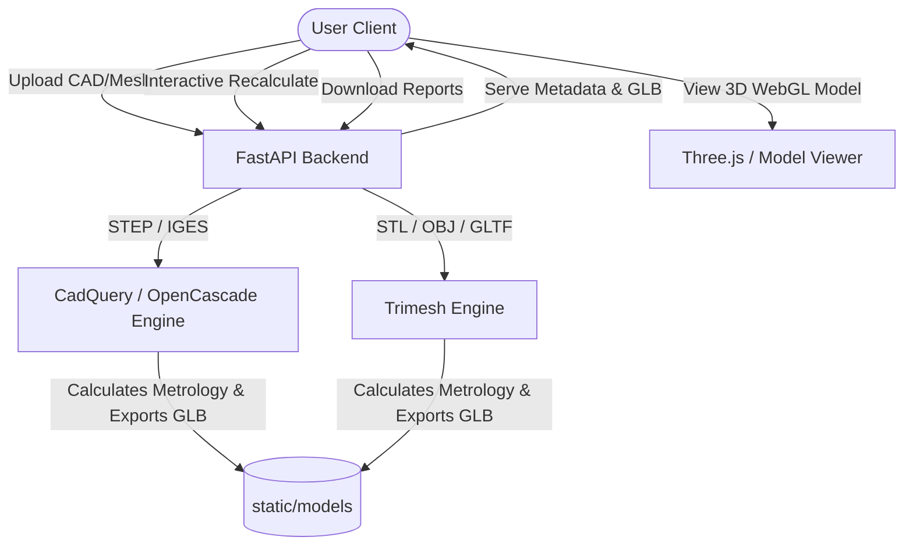

# BOMcad - Universal 3D CAD & Mesh Analyzer

BOMcad is a web-based, interactive 3D CAD and mesh analysis tool. It processes B-Rep engineering CAD files (STEP, IGES) and mesh files (STL, OBJ, GLTF, GLB) to calculate volume, surface area, center of mass, bounding boxes, and to generate custom Bills of Materials (BOM) with interactive weight calculations and multiple export formats.

The app uses **OpenCascade** (via **CadQuery**) for high-fidelity solid modeling parsing and **Trimesh** for mesh rendering and conversion, wrapped in a lightweight, responsive **FastAPI** web application.

---

## 🚀 Key Features

* **Multi-Format Support**:
  * **B-Rep CAD**: STEP (`.step`, `.stp`), IGES (`.iges`, `.igs`)
  * **Mesh Formats**: STL (`.stl`), OBJ (`.obj`), GLTF/GLB (`.gltf`, `.glb`)
* **3D Interactive Viewer**: Render full assembly files directly in the browser with orbital control, component highlighting, and distinct visual coloring for each part.
* **Automated Physical Metrology**:
  * Volume ($cm^3$) and Surface Area ($cm^2$) calculations per component.
  * Bounding box dimensions (envelope length, width, height) in millimeters.
  * Precise Center of Mass (COM) coordinates.
* **Interactive BOM Generator**:
  * Assign standard engineering materials (Steel, Aluminum, Titanium, Copper, PLA, Carbon Fiber, etc.) or set a custom density.
  * Recalculate weights instantly for individual components or the entire assembly.
* **Multi-Format Analytical Reports**: Export reports instantly in **PDF**, **Excel (XLSX)**, **CSV**, or raw **JSON** formats.

---

## 🛠️ System Architecture

The application is structured into a clean decoupled backend API and a fast, pure Javascript frontend:



---

## 📂 Repository Structure

```
├── main.py                # FastAPI Application & REST Endpoints
├── cad_parser.py          # OpenCascade (CadQuery) & Trimesh parsing engine
├── test_analyzer.py       # Automated suite of test fixtures for geometry pipelines
├── requirements.txt       # Python Dependencies
├── static/                # Single Page Frontend Application (SPA)
│   ├── index.html         # Main dashboard layout (semantic HTML5, SEO structured)
│   ├── index.css          # Modern slate-styled dashboard interface
│   ├── app.js             # Visual rendering & BOM interactivity controller
│   └── models/            # Temporary storage for generated WebGL GLB models (Git-ignored)
├── samples/               # Sample CAD files for user testing (IGES format)
├── uploads/               # Temporary CAD files (Git-ignored)
└── reports/               # Generated reports in CSV, XLSX, PDF (Git-ignored)
```

---

## 📥 Test Samples

To help you get started testing the application quickly, we have provided some sample IGES CAD models inside the [samples/](file:///c:/Users/Tanishq/OneDrive/Desktop/3d%20cad%20analyzer/samples) folder:

*   **`cube_with_hole.igs`**: A basic solid cube ($20 \times 20 \times 20\text{ mm}$) featuring a center vertical hole. Great for verifying standard geometric calculations.
*   **`simple_bracket.igs`**: A typical structural L-bracket ($40 \times 20 \text{ mm}$ base, $30\text{ mm}$ upright). Ideal for checking multi-axis bounds and volumes.
*   **`assembly_sample.igs`**: A multi-component assembly containing a box solid and a cylinder solid. Perfect for testing assembly breakdowns, multi-part interactive listing, and distinct color rendering.

Feel free to download any of these files and upload them to the web interface to verify analysis features!


---

## ⚙️ Installation & Setup

### Prerequisites
* Python 3.9 - 3.11 (Note: `cadquery` requires a compatible Python version, typically 3.9 or 3.10 is recommended for pre-built binaries).
* A system with OpenCascade binaries available (usually installed automatically via `pip` with `cadquery`).

### Steps
1. **Clone the repository**:
   ```bash
   git clone https://github.com/tsm56/BOMcad.git
   cd BOMcad
   ```

2. **Set up a virtual environment**:
   ```bash
   python -m venv .venv
   # Windows:
   .venv\Scripts\activate
   # macOS/Linux:
   source .venv/bin/activate
   ```

3. **Install dependencies**:
   ```bash
   pip install --upgrade pip
   pip install -r requirements.txt
   ```

4. **Run the application**:
   ```bash
   uvicorn main:app --reload
   ```

5. **Open the web dashboard**:
   Navigate to `http://127.0.0.1:8000` in your web browser.

---

## 🧪 Testing

BOMcad includes a suite of test cases to verify CAD and mesh translation correctness. Run the tests using:
```bash
python -m pytest test_analyzer.py
```

---

## 📜 License

Distributed under the MIT License. See [LICENSE](LICENSE) for more details.
